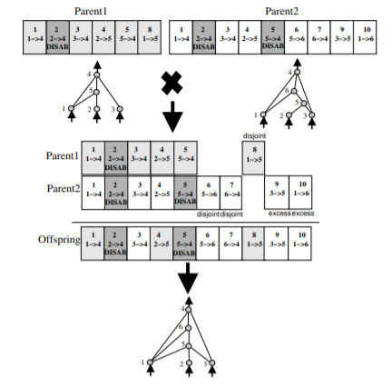

# NEAT-vs-PPO-Deep-Learning-Pong-
Have NEAT and PPO compete against each other in games of pong.

## Road Map
1. create preprocessing for observations
2. implement and train PPO
3. implement and train NEAT
4. create envirnoment where 2 agents can play
5. see which algorithm can outplay the other

## Proximal Policy Optimization
PPO is policy optimization algorithm that using a standard Deep-RL flow with a special objective function that prevents policy updates from being too large and causing performance collapse. 

Other than this PPO is essential the same process as other policy gradient methods. The policy and value networks and simple FCNNs. The change in position of both paddles and the change in position of the ball are processed from evironment image using some simple image and array processing.

## Neuroevolution of Augmented Topologies 
NEAT is an algorithm that using a tradition genetic algorithm approach but each agent is a computational graph resemmbling a neural network. Each of these graphs is allowed to mutate and mate with other graphs. Graphs are grouped into spieces by some similarity distance and assigned a fitness. As generations evolve each spieces represents a different strategy encoded in the genes of the members of the spieces. 
