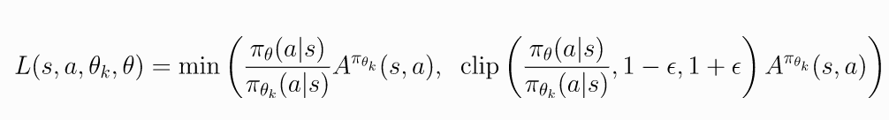

# NEAT vs PPO AI Pong
Have NEAT and PPO compete against each other in games of pong.
Full project in Google Colab.

## Road Map
1. create preprocessing for observations
2. implement and train PPO
3. implement and train NEAT
4. Analyze Performance of both Algorithms (Coming Soon)

In the future, an environment where both algorithms can play against eachother could be written. This will provide a more pure measurement of which algorithm is dominant at pong.

## Vanilla Policy Optimization

Vanilla Policy Optimization generally entails an agent being present in an environment. The environment has a state and the agent can take an actions the gets a new state and a reward for that action. The goal of the algorithm is to train a policy network i.e. a neural network that takes in a state and outputs a distribution of actions. To do this we have use a neural network for the policy and another for the value. Value is the expected future rewards for being in a given state i.e. how much rewards you expect to get by being in a state. This value network is used to estimate advantage which is a measurement of how good an action is in a given state. This advantage measurement is then use by the policy networks to reinforce good actions and make bad actions less likely. The agent plays episodes of the game and stores the states, actions, and rewards in a memory. These memories of actions, states, and rewards are called trajectories. Trajectories are then used to train the value network and the policy network.

## Genetic Algorithms
Genetic algorthims are inspired by the biological principle of naturally selection. Generally, a population of agents is initialized. Memebers of the population are given a fitness score. Species, groups of similar members of the population, grow according to their average fitness scores. Selection is kept within species to allow for new structures to try to survive within their niche. Members are also subject to random mutations. After many generations, certain species and members will have evolved effective strategies from random mutation.

## Proximal Policy Optimization
PPO is policy optimization algorithm that using a standard Deep-RL flow with a special objective function that prevents policy updates from being too large and causing performance collapse. 

Other than this PPO is essential the same process as other policy gradient methods. The policy and value networks and simple FCNNs. The change in position of both paddles and the change in position of the ball are processed from evironment image using some simple image and array processing.

## Neuroevolution of Augmented Topologies 
 NEAT is an algorithm that uses a tradition genetic algorithm approach where each agent is a computational graph resemmbling a neural network. Each of these graphs is allowed to mutate and mate with other graphs. Graphs are grouped into spieces by some similarity distance and assigned a fitness. As generations evolve each spieces may use a different strategy to play the game.
